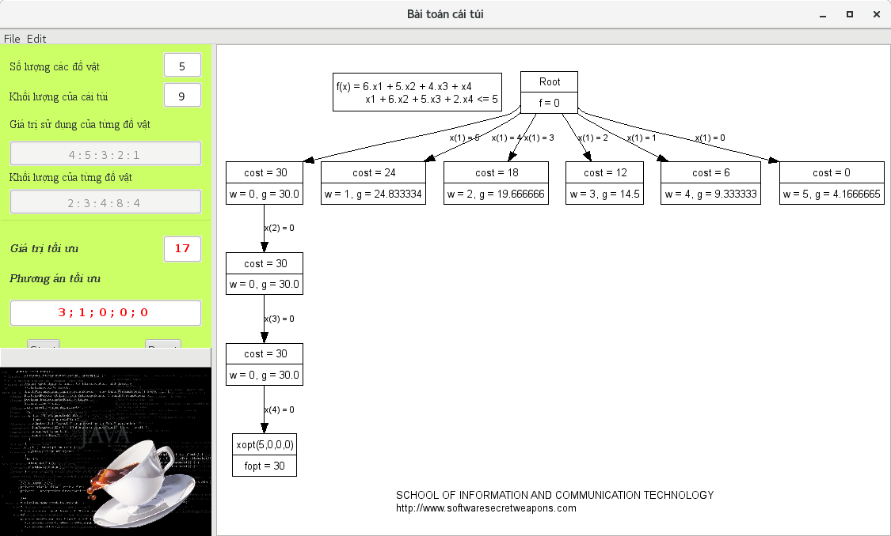

# knapsack `Bài toán cái túi` (This's first application)

## Subject

Toán rời rạc at HUST

## Description

Một nhà thám hiểm cần đem theo một cái túi có trọng lượng không quá `B`. Có đồ vật có thể đem theo. Đồ vật thứ `j` có trọng lượng là `a[j]` và giá trị sử dụng là `c[j]` `(j = 1, 2, 3, ..., n)`. `Hỏi rằng nhà thám hiểm cần đem theo các đồ vật nào để cho tổng giá trị sử dụng của các đồ vật mang theo là lớn nhất ?`

## Language

Java swing using `oy-lm-1.1` to draw a graph.

You must install jdk to compile, run project. And install ant to run, build project

## Algorithm

Thuật toán nhánh cận.

## Running

```
$ git clone https://github.com/giatuyentiensinh/knapsack.git
$ cd knapsack
$ ant run
```

## Pics



# Auth `Tuyenng`
Copyright (c) 2014
